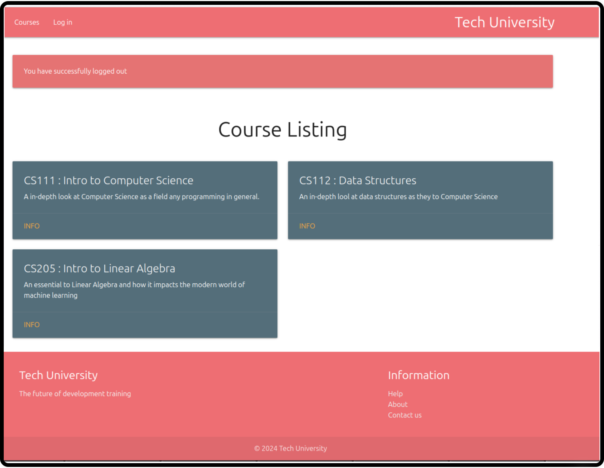

# Tech University App

- This app have Students & Courses
- Student enroll & unenroll in courses
- Student can edit your's profile
- User view all user's profile
---

#### This Project is part of [Udemy Course "The Complete Ruby on Rails Developer Course"](https://www.udemy.com/course/the-complete-ruby-on-rails-developer-course/)

---

#### For more info OR suggestion contact me on

- ### My Twitter :- <a href="https://twitter.com/ramgopalsiddh1/"> Twitter/ramgopal </a>

- ### Portfolio :- <a href="https://ramgopal.dev/">ramgopal.dev</a>
---

## Screenshots

#### Home page without login
  

#### All Courses
  

#### All Students
  

#### Show user profile
  

#### Edit User profile
  

#### Show other user's profile
  

#### Home when User don't login
  

This README would normally document whatever steps are necessary to get the
application up and running.

Things you may want to cover:

* Rails version: 7.1.3

* Ruby version: ruby 3.2.3 (2024-01-18 revision 52bb2ac0a6) [x86_64-linux]

* For Setup this project follow these steps
  1. Get code 
  2. Set up [Stripe API key](https://docs.stripe.com/api)
  3. Run `bundle install` for install all Gem's from Gemfile
  4. Run `rails db:migrate` for run Migrations and create db
  5. Run Server `rails server`
  6. visit [localhost:3000](http://127.0.0.1:3000)
